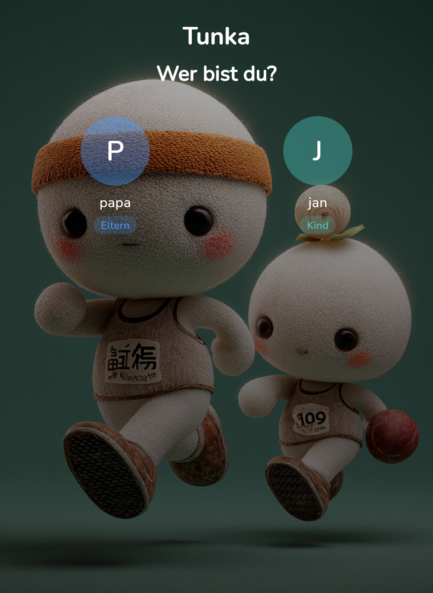
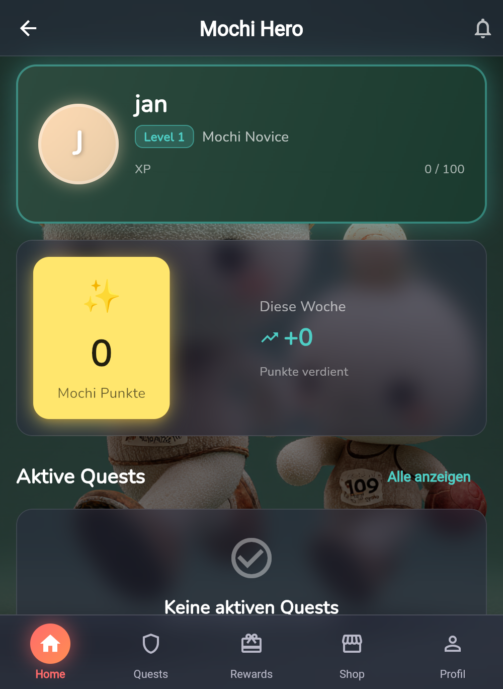
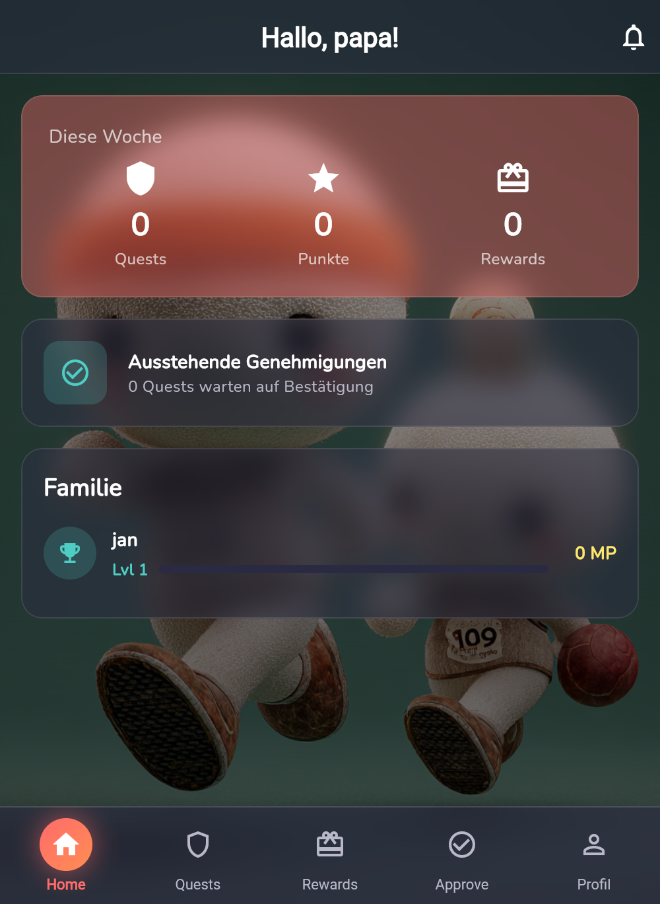
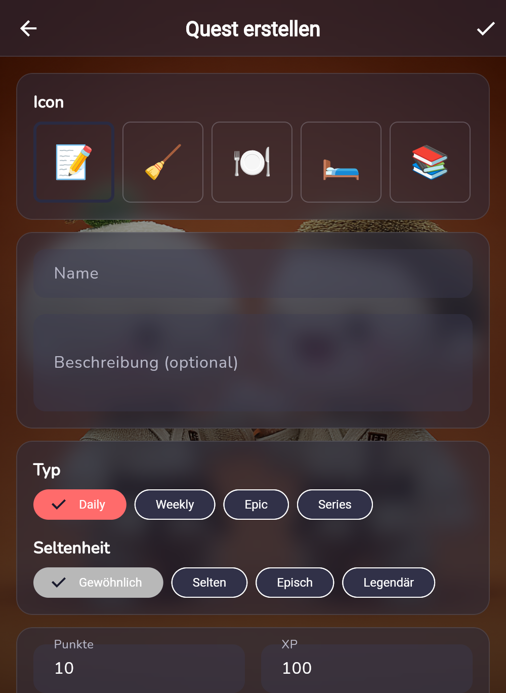
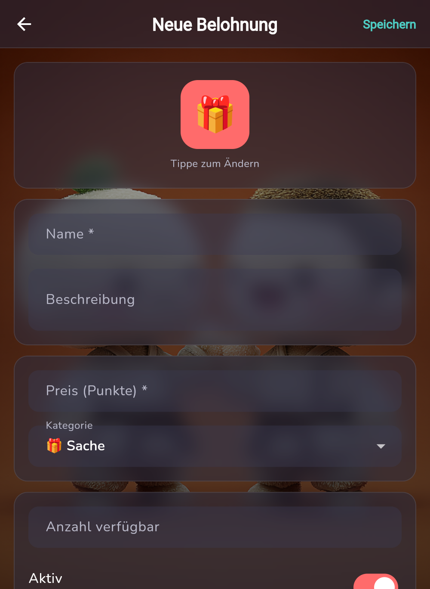
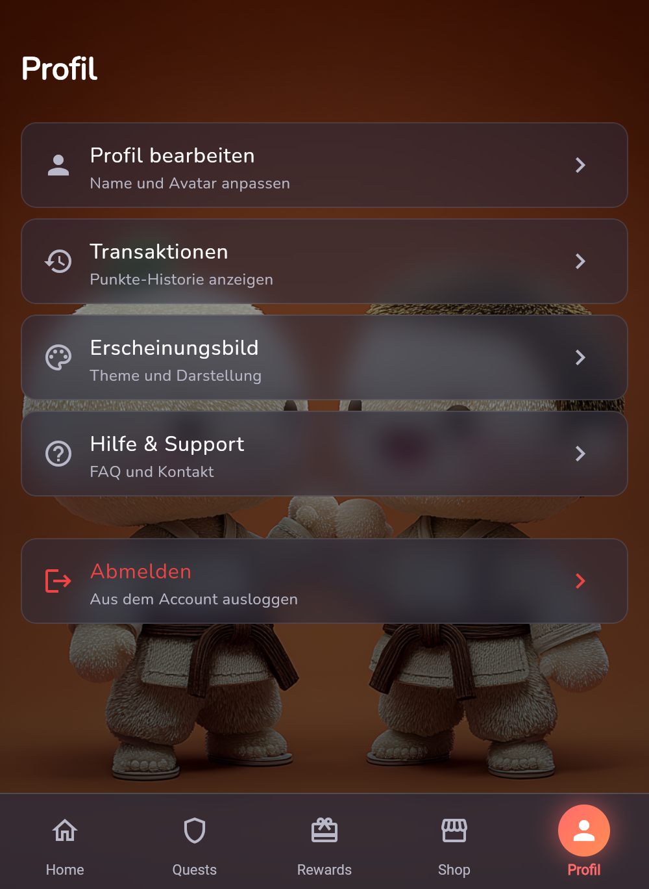

# Mochi Points

A gamified family rewards app where parents create challenges and children earn **Mochi Points** by completing quests. Household chores become an engaging gaming experience with levels, streaks, achievements, and a customizable avatar system.

## Screenshots

<p align="center">
  
  
  
</p>
<p align="center">
  
  
  
</p>

## Core Concept

- **Parents (Quest Masters)** create quests, set up rewards, and approve completed tasks
- **Children (Mochi Heroes)** accept quests, earn points, level up, and buy rewards
- **Gamification** with XP, levels, streaks, achievements, and avatar customization

## Features

### For Children
- **Hero Dashboard** - Level, XP progress, Mochi Points balance, active quests
- **Quest Board** - Browse and accept daily, weekly, epic, and series quests
- **Reward Shop** - Spend earned Mochi Points on experiences, items, and privileges
- **My Rewards** - Track active and redeemed purchases

### For Parents
- **Dashboard** - Weekly stats, pending approvals, family overview
- **Quest Management** - Create and manage quest templates with rarity tiers
- **Reward Management** - Set up purchasable rewards
- **Approval Workflow** - Review and approve/reject completed quests and redemptions

### Gamification Systems
- **XP & Leveling** - Level up through quest completion (100 + (level-1) x 50 XP per level)
- **Streak System** - Consecutive activity days with bonus multipliers (up to +50%)
- **Achievements** - Unlockable badges with progress tracking
- **Points Economy** - Earn through quests, spend on rewards
- **Rarity Tiers** - Common, Rare, Epic, Legendary quests with visual distinction

## Tech Stack

| Technology | Purpose |
|---|---|
| Flutter 3.41+ / Dart 3.11+ | Cross-platform framework |
| Provider | State management (ChangeNotifier pattern) |
| SharedPreferences | Local storage (MVP) |
| Google Fonts (Nunito) | Typography |
| flutter_animate | Animations |
| confetti | Celebration effects |

## Getting Started

### Prerequisites
- Flutter SDK ^3.11.0
- Dart ^3.11.0

### Installation

```bash
# Clone the repository
git clone https://github.com/martinvidec/mochi-points-flutter.git
cd mochi-points-flutter

# Install dependencies
flutter pub get

# Run the app
flutter run -d chrome
```

### Build

```bash
flutter build apk                          # Android
flutter build ios                          # iOS
flutter build web --no-tree-shake-icons    # Web
```

> **Important:** Always use `--no-tree-shake-icons` for web builds. Flutter's tree-shaking aggressively removes dynamically loaded icons.

## Project Structure

```
lib/
├── main.dart              # App entry, provider setup, cross-provider wiring
├── models/                # Data models (Quest, Hero, Reward, Achievement, ...)
├── providers/             # State management (8 providers)
├── pages/                 # Screens (child/, parent/, setup/)
├── widgets/               # Reusable UI components (glass cards, quest cards, ...)
├── services/              # Business logic (levels, streaks, storage, backgrounds)
└── theme/                 # Dark gaming theme with glassmorphism

docs/
├── MVP_CONCEPT.md         # Product specification
├── UI_DESIGN.md           # Design system & components
├── DATA_MODEL.md          # Data models & relationships
└── MVP_PHASENPLAN.md      # Development phase plan
```

## Design

Dark gaming theme with glassmorphism UI, featuring:

- **Primary Gradient**: Coral (#FF6B6B) to Orange (#FF8E53)
- **Accent Gold**: #FFE66D (Mochi Points)
- **Background**: Animated mochi character artwork with dark overlay
- **Cards**: Frosted glass effect containers

## Current Status

**Phase:** MVP Development

- [x] Family setup & authentication (PIN-based)
- [x] Parent dashboard with real-time stats
- [x] Quest system (CRUD, assignment, approval workflow)
- [x] Reward system (shop, purchases, redemption)
- [x] Points economy with streak bonuses
- [x] Notification system
- [x] Achievement framework
- [x] Dark gaming theme with glassmorphism
- [ ] Firebase/Supabase migration (currently local storage)
- [ ] Push notifications
- [ ] Advanced avatar rendering

## Documentation

| Document | Description |
|---|---|
| [MVP Concept](docs/MVP_CONCEPT.md) | Full product specification |
| [UI Design](docs/UI_DESIGN.md) | Design system, components, animations |
| [Data Model](docs/DATA_MODEL.md) | Entity relationships & Dart code |
| [Phase Plan](docs/MVP_PHASENPLAN.md) | Development roadmap |

## License

Private project - all rights reserved.
